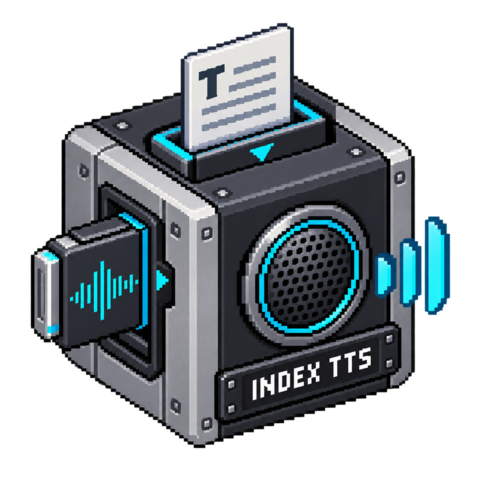

# IndexTTS-2

[](media/cover.png)

<!-- block-metadata:start -->
[](model.json)
[](compatibility.json)
[](LICENSE)

Verified BloxSmith versions: **1.0.9** (bundled-block tests; see [test evidence](compatibility.json)).
<!-- block-metadata:end -->


Local **IndexTTS-2** synthesis from text and a short **required voice reference**. The block loads the pinned model in a separate Python process; it does not call a cloud service or substitute IndexTTS-2.5.

## Connect it

| Port | Contract |
| --- | --- |
| `text` input | Plain text, or JSON `{"text":"Hello","request_id":"example-1"}`. English and Chinese are the model's documented languages; this is not a translator. |
| `command` input | JSON `{"action":"interrupt"}` cancels current synthesis and discards earlier queued requests. |
| `audio_file` output | Absolute path to a complete uniquely named Ogg/Opus or WAV file. |
| `metadata` output | Correlation ID, model/SDK revisions, audio duration, codec, file checksum, segment/token counts and reference checksum. No raw text or reference path. |
| `status` output | Completion, cancellation or a recoverable, bounded diagnostic. |

There is **no direct audio-stream port**. File-path output is not compatible with an `audio_stream` input; use a file-aware consumer. A command never replays cached text. Plain text resembling JSON remains speech unless its input MIME is `application/json`.

## Prepare a local model environment

Use a dedicated **Linux Python 3.10 or 3.11** environment and install [requirements.txt](requirements.txt) into it, not into BloxSmith. Choose matching Torch/torchaudio CPU or CUDA wheels for your host. The worker checks the SDK Git revision and critical package versions. Nothing is installed automatically.

The [artifact manifest](model_artifacts.json) describes **7,664,316,034 bytes** of pinned IndexTTS-2 and auxiliary files, excluding the Python environment. It includes the w2v-BERT, MaskGCT semantic codec, CAMPPlus and BigVGAN dependencies. QwenEmotion, DeepSpeed, compiled CUDA kernels and automatic model downloads are disabled. The SDK, weights and their licenses are supplied separately.

Read-only inventory:

```sh
python setup_model.py --directory MODEL_ASSET_DIRECTORY
```

After reviewing the upstream licenses, explicitly prepare public files:

```sh
python setup_model.py --directory MODEL_ASSET_DIRECTORY --download-public
```

The helper checks available space before download, pins immutable URLs and verifies every file's size and SHA-256 or upstream Git-blob digest. Corrupt existing files are refused, not overwritten. At runtime the same files are verified without download. Do not add an unpinned `model/glossary.yaml`: it is rejected rather than implicitly loaded by the SDK.

Select the asset directory and dedicated Python executable in the modal or inspector. Choose CPU or CUDA explicitly: unavailable CUDA never falls back silently; CPU requires float32. The available-RAM check is a preflight, not a reservation or VRAM-capacity guarantee. Models reload for each request, so this is not a warmed realtime service.

## Voice and generation settings

Set **Voice reference audio** to a finalized local clip you are authorized to reproduce. Accepted containers: WAV, Ogg, WebM, FLAC, MP3, M4A or MP4 with audio. The first audio track is decoded locally. Reference clips must be **0.5–15 seconds**, non-silent, and at most 32 MiB. Overlong clips are refused; the SDK's implicit 15-second cropping is not used. Relative paths resolve against the application root. A private bounded snapshot leaves the original unchanged and is normally removed after the request.

Choose reference delivery or one of eight documented emotion directions; an optional intensity controls the requested vector. These are model conditioning parameters, not guarantees of perceived emotion or identity. No invented voice list, multilingual selector, precise-duration control or text-to-emotion API is exposed.

Native output is mono PCM16 WAV at **22,050 Hz**. The default format is a complete **Ogg/Opus file at 48 kHz**. Every native segment must reach its actual end-of-sequence token, and all expected segments must finish. Token exhaustion, missing segments, silence, invalid PCM or an overlong decoded result rejects the whole file. EOS proves technical termination, not linguistic accuracy: listen to outputs before relying on pronunciation or completeness of spoken content.

The request deadline covers reference conversion, verification, loading, synthesis and publication, with a maximum of 240 seconds. Text size, segments, per-segment tokens, generated duration, parallel CPU threads and the local pending queue are bounded.

## Execution, storage and interruption

Simulation/One Shot synthesizes on execution. Active Runtime starts its passive listener on Run, but does no inference without a fresh text event. One job runs at a time; up to four requests wait by default. Setting the pending limit to zero rejects new work while busy. Interrupt cancels owned computation and clears earlier waiting work. It cannot retract a previously published file or stop a separate player; wire its own interrupt command as well.

Stop and abrupt runtime-host death fence the owned process group. Normal cancellation removes private job copies and never publishes partial output. A forcibly killed host can leave an unreferenced private job directory. This is process isolation, **not an OS sandbox** for the selected executable, SDK or trusted weight files.

Completed files live in the selected output directory, or the node's persistent `audio/` directory through the public block storage service. Publication is atomic, names are unique, and existing files are never overwritten or automatically deleted. No framework modification or production cross-block import is needed.

## Verification status

Three block-owned suites passed against the pinned BloxSmith 1.0.9 framework,
including 17 unit cases, both runtimes across bundled/managed/linked origins,
interruption/recovery and responsive English/French modal and inspector checks.
Current-source compatibility evidence is recorded in [compatibility.json](compatibility.json).

Block qualification uses explicit SDK/model doubles plus genuine FFmpeg conversion, process supervision, framework runtimes, managed/linked packages and browser interfaces. It does **not** establish actual model quality, startup latency, GPU memory needs or a successfully installed full inference environment. Actual-weight qualification remains pending adequate storage and a prepared environment.

An explicit real-model smoke helper is provided in `tests/qualify_model.py`; it is read-only by default and never installs packages or downloads weights. Model files, environments, reference audio and private framework test infrastructure are excluded from Git.

## Licenses and voice rights

This block's own code is Apache-2.0. That does **not** relicense the SDK, models or dependencies:

- IndexTTS-2 code and weights carry the **Bilibili Model Use License**, including its use and additional-license conditions. Review the complete terms.
- The required **amphion/MaskGCT** model card declares **CC-BY-NC-4.0**. This non-commercial dependency prevents treating the whole prepared stack as generally cleared for commercial use.
- The pinned w2v-BERT and BigVGAN model cards declare MIT; CAMPPlus declares Apache-2.0.

No upstream weights or SDK source are redistributed in this repository. Installing public files does not grant rights beyond their licenses. Obtain permission for the reference voice and disclose synthetic speech where appropriate; avoid impersonation.

Sources: [official SDK at the pinned revision](https://github.com/index-tts/index-tts/tree/d9e41aac89fd00b3d71497fddb287b7f24613712), [IndexTTS-2 weights and terms](https://huggingface.co/IndexTeam/IndexTTS-2/tree/740dcaff396282ffb241903d150ac011cd4b1ede), [MaskGCT model card](https://huggingface.co/amphion/MaskGCT/blob/265c6cef07625665d0c28d2faafb1415562379dc/README.md), [w2v-BERT](https://huggingface.co/facebook/w2v-bert-2.0), [CAMPPlus](https://huggingface.co/funasr/campplus), [BigVGAN](https://huggingface.co/nvidia/bigvgan_v2_22khz_80band_256x).
